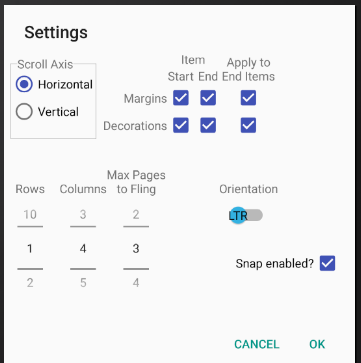
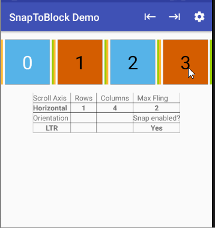

## RecyclerView SnapToBlock Demo

This is an Android Studio project that demonstrates the use of the Java class 
`SnapToBlock` that enables an Android app to snap `RecyclerView` scrolling to a block of 
items. This class is based upon 
[`SnapHelper`](https://developer.android.com/reference/android/support/v7/widget/SnapHelper.html).

### Getting Started

This project can be imported directly into Android Studio using the menu selection 

`New->Project from Version Control->GitHub`

### Operation

The demo app creates a `RecyclerView` that adheres to a set of parameters defined in the "Settings" dialog. 
The main activity creates and displays the `RecyclerView` with blue and reddish squares as views of the
`RecyclerView`. These views can be scrolled to demonstrate how blocks are snapped.

### Settings Dialog

**Scroll Axis:** _Horizontal_ or _Vertical_ defines how the `RecyclerView` will be laid out and scrolled.

**Orientation:** _LTR_ for a "left-to-right" or _RTL_ for a "right-to-left" layout.

**Rows**: The number of rows to display in the `RecyclerView`.

**Columns:** The number of columns to display.

**Max Page to Fling:** The maximum number of pages to fling at one time. A page is `rows * columns`.

**Margins-Items Start/End:** If checked, `RecyclerView` items will have a `4dp` margin applied to the
start and/or end of each of its views except for the start/end edge views whose margins are controlled
by the value of "Margins-Apply to End Items."

**Margins-Apply to End Items:** If checked, a `4dp` margin will be applied to the views that fall
at the left and right edges of the `RecyclerView`, when fully scrolled to the left or right horizontally, and the top
and bottom edges of the `RecyclerView` when fully scrolled vertically. These are views at the greatest scrolled
extents of the `RecyclerView`.

**Decorations-Items Start/End:** Like _Margins-Items Start/End_ but applies to `4dp` decorations.

**Decorations-Apply to End Items:** Like _Margins-Apply to End Items_ but applies to `4dp` decorations.

**Snap enabled?** If checked, `SnapToBlock` is attached to the `RecyclerView`; otherwise, snapping 
is not in effect.

### Demo Video

The following video shows a 1x4 display that snaps to four-block sections while scrolling left
and right. The same is shown for a right-to-left layout.

When scrolling, `SnapToBlock` will choose a block to snap to and make a call to `onBlockSnap()` to 
report the selected position of the block in the adapter. On the display, this "target" position 
is identified with a "T" appended to the block number. 

Once the targeted block is snapped into place, `SnapToBlock` calls `onBlockSnapped()` to report
that the targeted block has been snapped. The `TextView` for the snapped block will then show the block 
number followed by the letter "S" to identify the snapped block.

### Known Issues

`RecyclerView#SmoothScrollToPosition` may produce excessive view holders especially when scrolling 
to the top of ``RecyclerView`` data. It is unclear if these excessive viewholders, that can number in 
the 100's or higher, are ever released back to the system. This behavior occurs independently 
of `SnapToBlock`. To limit the number of view holders 
created, the CTOR for the adapter explicitly sets the size of the view pool for each view holder
type to something reasonable by calling `RecyclerView.RecycledViewPool#setMaxRecycledViews`. This seems
to staunch the creation of too many view holders. 

An count of the number of view holders created by view holder type is maintained in an `int` array 
called `mViewHolderCount`. Anyone who is interested may use these counts to monitor the creation
of view holders.

### License

Refer to  [LICENSE.txt](LICENSE.txt) for license information.

